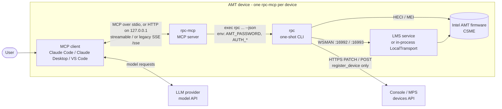
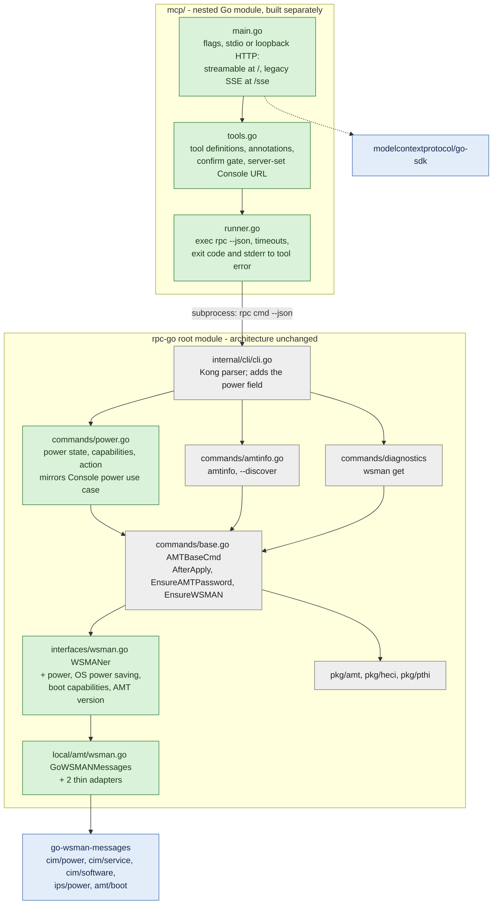
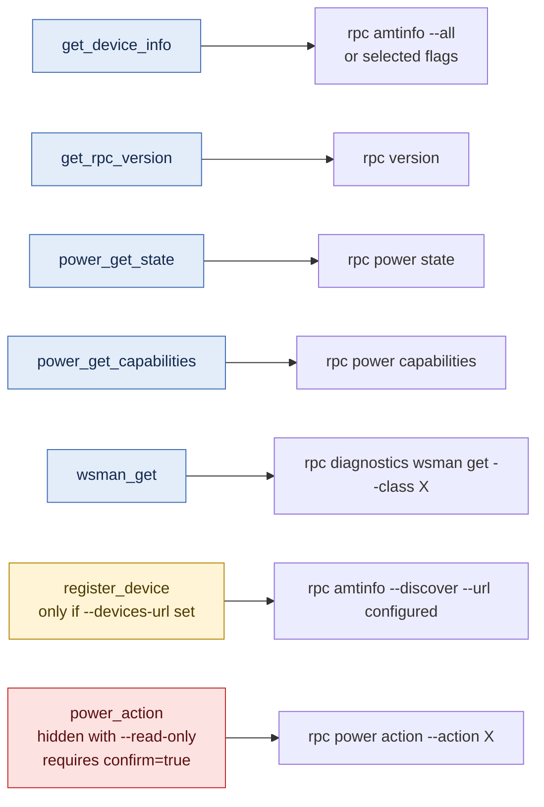
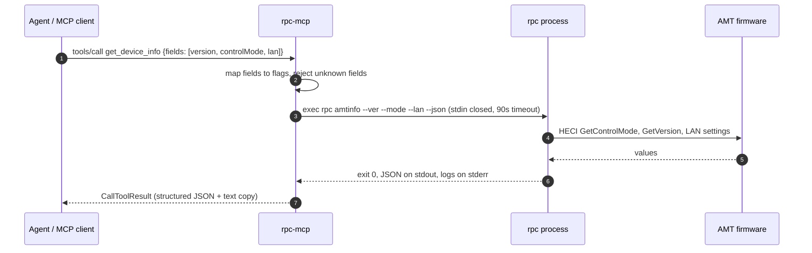
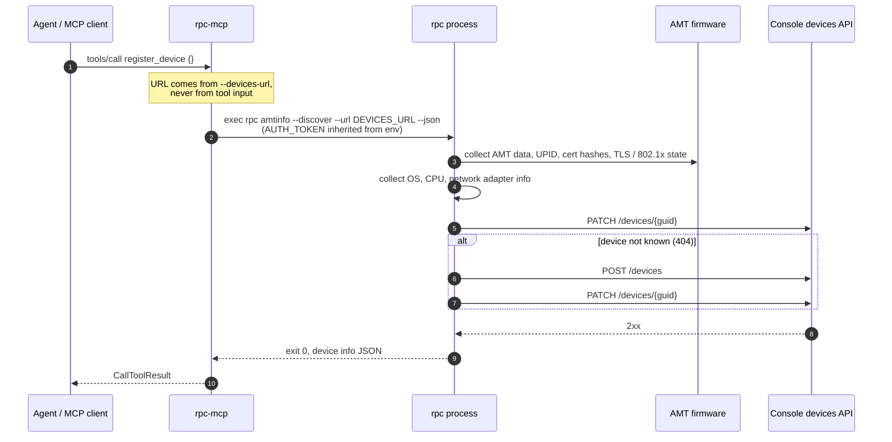
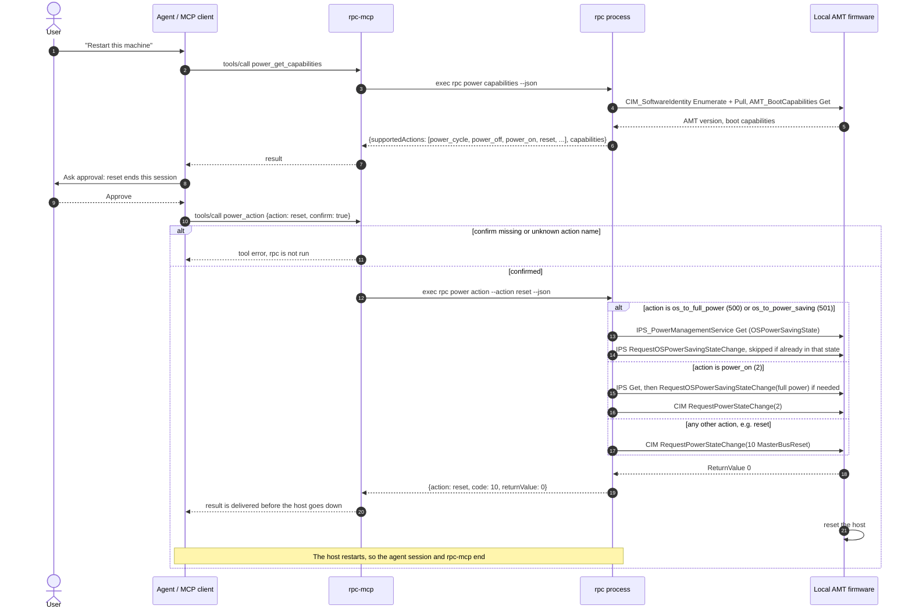
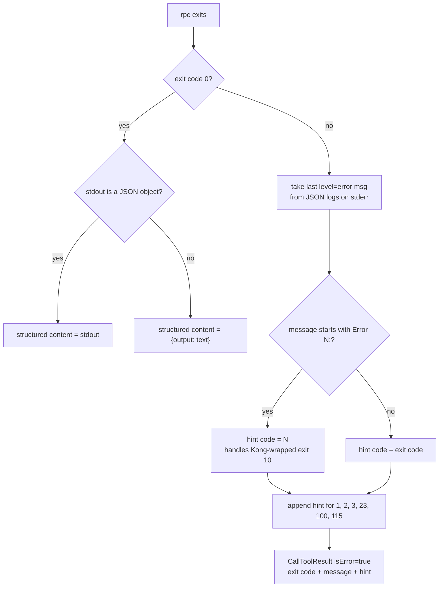
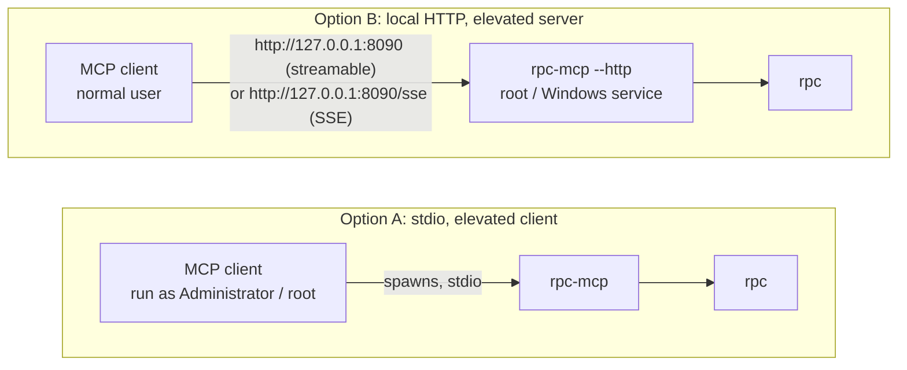

# rpc-mcp architecture and design decisions

This document records why rpc-mcp is shaped the way it is: an MCP server that lets AI agents read Intel AMT device information and perform power actions through rpc-go. Setup and usage are in the [README](../README.md).

## Context

rpc-go is a **one-shot CLI** built on Kong. `cmd/rpc/main.go` calls `cli.Execute`, which runs one command and exits. It manages **only the device it runs on**:

- It reaches AMT firmware over the MEI/HECI driver (`pkg/amt` → `pkg/pthi` → `pkg/heci`).
- It sends WSMAN through LMS at `127.0.0.1:16992/16993`, falling back to an in-process `LocalTransport` over HECI when LMS isn't installed (`internal/local/amt`).
- There is no daemon mode and no way to target a remote AMT host. The global `--lmsaddress`/`--lmsport` flags are parsed but unused.

**"Discovery" in rpc-go is not a network scan.** `rpc amtinfo --discover --url <console>/api/v1/devices` (aliases of `--sync`) makes the device collect its own inventory (`InfoService.GetAMTInfo` plus `populateDiscoveryFields` in `internal/commands/amtinfo*.go`: AMT data, UPID, certificate hashes, OS, CPU, network adapters, …). It then registers that inventory with Console by PATCH, or POST when the device is new.

Before this work rpc-go had **no power command**. Console already has one (REST `power/action`, `power/state`, `power/capabilities`, and MCP tools `power_get_state`, `power_get_capabilities`, `power_action`), but it reaches devices remotely by GUID. go-wsman-messages provides every WSMAN message Console uses.

**Goal:** an AI agent can get device info and run power actions, with **minimal change to rpc-go and no change to its architecture**.

## Decisions

### D1: Run the MCP server on each device (local topology)

rpc-go only works locally, so the MCP server lives on the AMT device beside the rpc binary. There is one rpc-mcp per device, and the agent manages the device it runs on.

*Alternatives considered:*
- A central MCP server talking to Console/MPS REST APIs, which would allow fleet-wide and out-of-band power control without changing rpc-go.
- A hybrid of the two.

These remain good future options for fleet scenarios. The local model was chosen to work directly with rpc-go.

*Consequence:* power actions that stop or restart the host also end the agent session (see D6).

### D2: Run the rpc binary as a subprocess instead of importing rpc-go

rpc-mcp calls `exec.CommandContext(rpc, args..., "--json")` and parses stdout.

- All rpc-go command logic lives in `internal/`, which another module can't import. Exposing it would mean restructuring rpc-go.
- rpc-go already supports `--json` and types its failures by exit code (`utils.CustomError.Code`).
- rpc-go itself already uses this model: the profile orchestrator (`internal/orchestrator/executor.go`, `CLIExecutor`) re-invokes `rpc` per step for isolation and exit-code typing.
- Each call is isolated. A HECI lock, WSMAN session leak or firmware quirk can't affect later calls, and the MEI handle is never held by a long-running process.
- rpc-mcp and rpc can be versioned and released independently.

*Rejected:*
- A `rpc mcp` subcommand or long-running daemon inside rpc-go, which would change rpc-go's one-shot architecture and lifecycle (`AMTBaseCmd.AfterApply` runs once per process).
- Wrapping the C-shared library (`rpcExec`), which needs CGO and captures the process-wide stdout/stderr.

### D3: Nested Go module in the rpc-go repo

The code lives in `rpc-go/mcp/` with its own `go.mod` (`github.com/device-management-toolkit/rpc-go/v2/mcp`):

- It builds on its own (`cd mcp && go build`, or `make mcp`).
- The root module ignores nested modules. rpc-go's `go build ./...`, `go test ./...`, `go.mod`, Dockerfile and release scripts are unchanged, and the root module doesn't depend on the MCP SDK.
- No rpc-go code is imported, so the directory can move to its own repository later without code changes.

### D4: Add one self-contained `power` command to rpc-go

This is the only functional change to rpc-go. It follows the existing command pattern (CLAUDE.md):

| File | Change |
|---|---|
| `internal/interfaces/wsman.go` | `WSMANer` gains `GetPowerState`, `RequestPowerStateChange`, `GetOSPowerSavingState`, `RequestOSPowerSavingStateChange`, `GetBootCapabilities` and `GetAMTVersion`, the same calls Console's wsman layer makes |
| `internal/local/amt/wsman.go` | Thin adapters over go-wsman-messages: `CIM.ServiceAvailableToElement` and `CIM.SoftwareIdentity` (Enumerate+Pull), `CIM.PowerManagementService.RequestPowerStateChange`, `IPS.PowerManagementService` Get and `RequestOSPowerSavingStateChange`, and `AMT.BootCapabilities` Get |
| `internal/mocks/wsman_mock.go` | Regenerated (`make mock`) |
| `internal/commands/power.go` (+ `_test.go`) | `PowerCmd` with `state`, `capabilities` and `action` subcommands |
| `internal/cli/cli.go` | `Power` field on `CLI`, and `commandPower` in `knownCommands` |

The command:
- `rpc power state [--json]` prints `{"powerState": N, "osPowerSavingState": M}`.
- `rpc power capabilities [--json]` prints `supportedActions` and Console's capability codes.
- `rpc power action --action <name> [--json]` takes one of Console's action names and prints `{"action", "code", "returnValue"}`.
- All three embed `AMTBaseCmd` and use `EnsureAMTPassword` then `EnsureWSMAN`. They require an activated device (`utils.DeviceNotActivated`) and return `WSMANMessageError` on WSMAN failure or a non-zero `ReturnValue`.
- Names, codes and behavior follow Console exactly. See D9.

The rest of rpc-go is untouched: `amtinfo`, discovery, LMS/LME handling, activation paths, the orchestrator, and the C-shared library.

### D5: The tool surface maps 1:1 onto rpc commands

| Tool | rpc invocation |
|---|---|
| `get_device_info` (`fields` optional) | `amtinfo --all` or `amtinfo --ver --mode …` |
| `get_rpc_version` | `version` |
| `power_get_state` | `power state` |
| `power_get_capabilities` | `power capabilities` |
| `wsman_get` | `diagnostics wsman get --format json --class …` |
| `register_device` (discovery) | `amtinfo --discover --url <server-configured URL>` |
| `power_action` | `power action --action <name>` |

`--json` is always appended. rpc's JSON stdout is returned as MCP structured content, and the SDK mirrors it as text content. Non-JSON stdout is wrapped as `{"output": "..."}`.

### D6: Safety

- **No secrets in argv or tool input.** rpc inherits rpc-mcp's environment (`AMT_PASSWORD`, `AUTH_*`), so passwords never appear in process listings or in the model's context.
- **The server sets the Console URL.** `register_device` takes no URL input and is only registered when `--devices-url` is set. This stops a prompt-injected agent from sending device inventory and Console credentials to an arbitrary endpoint.
- **Power actions are double-gated.** The tool is annotated `destructiveHint: true`, and the server refuses to run it unless `confirm: true` is passed. Its description tells the agent to check `power_get_capabilities` and get explicit user approval first. This gate is the one deliberate addition over Console's `power_action`, because here the agent runs on the machine it controls. `--read-only` removes the tool.
- **Self-termination is expected and documented.** AMT acknowledges `RequestPowerStateChange` before acting, so the result reaches the agent before the host goes down.
- **No interactive prompts.** rpc runs with no stdin, so a missing password or elevation fails fast with a typed error instead of hanging.
- **HTTP transport is loopback-only.** The HTTP endpoints (streamable `/` and legacy SSE `/sse`) have no authentication, so `--http` rejects non-loopback addresses. The SDK's DNS-rebinding protection (non-localhost `Host` returns 403) stays enabled.

### D7: Error mapping

A non-zero rpc exit becomes an MCP tool error (`isError: true`), not a protocol error, so the agent can reason about it. The message contains:
- the exit code;
- the last `level=error` message from rpc's JSON logs on stderr;
- a hint for well-known codes (permissions, HECI, password, not activated).

rpc returns GenericFailure (10) when Kong wraps a typed error raised in a hook such as `AfterApply`. In that case rpc-mcp takes the code from the logged `Error <code>:` prefix to choose the hint.

### D8: Privileges

HECI requires administrator or root, and rpc-mcp adds nothing on top of that. The supported options are an elevated MCP client (stdio), or an elevated rpc-mcp in local HTTP mode that an unprivileged client connects to. Without elevation, `get_device_info` still returns OS-level data, because `amtinfo` degrades gracefully.

### D9: Power behavior mirrors Console, executed locally

**Context.** The agent runs on the device and doesn't go through Console. Power control must still be done by AMT (not by OS shutdown commands), and it should behave the way Console's power feature does, so results are the same whichever way a device is managed.

**Decision.** rpc's `power` command reimplements Console's power use case (`console/internal/usecase/devices/power.go`) and its MCP naming (`console/internal/controller/mcp/power_actions.go`, `power.go`). The target is the local AMT, reached through LMS (`127.0.0.1:16992/16993`) or HECI, not a device GUID in Console:

| Console | rpc | Local WSMAN calls |
|---|---|---|
| `GetPowerState` / MCP `power_get_state` | `rpc power state` | `CIM_ServiceAvailableToElement` Enumerate+Pull (`[0].PowerState`), then `IPS_PowerManagementService` Get (`OSPowerSavingState`). Either failing is an error. |
| `GetPowerCapabilities` / MCP `power_get_capabilities` | `rpc power capabilities` | `CIM_SoftwareIdentity` (major version of `InstanceID == "AMT"`) and `AMT_BootCapabilities` Get, then `determinePowerCapabilities` (basic 2/5/8/10, plus 12/14/4/7 when AMT > 9, plus the BIOS/secure-erase/diagnostic codes from boot capabilities, plus IDE-R and PXE codes) |
| `SendPowerAction` / MCP `power_action` | `rpc power action --action <name>` | 500/501: IPS `RequestOSPowerSavingStateChange` only (no-op if already in that state). 2: the same OS full-power step first, then CIM `RequestPowerStateChange(2)`. Others: CIM `RequestPowerStateChange(code)` directly. |

The action names and codes are identical to Console's MCP `powerActionNames`: `power_on` 2, `sleep` 4, `power_cycle` 5, `hibernate` 7, `power_off` 8, `power_off_soft` 9, `reset` 10, `soft_off` 12, `soft_reset` 14, `os_to_full_power` 500, `os_to_power_saving` 501. `TestPowerActionNamesMatchConsole` pins this mapping.

As in Console:
- there is no pre-check of the current state; AMT rejects impossible transitions with a `ReturnValue` such as 4097;
- boot-target actions (BIOS 100/101, secure erase 104, IDE-R 200–203, diagnostics 300/301, PXE 400/401, HTTPS/PBA/WinRE 105–110) appear in `capabilities` but aren't accepted by `power action`, because they need Console's separate boot-options flow (AMT_BootSettingData Put, CIM_BootConfigSetting.ChangeBootOrder, CIM_BootService.SetBootConfigRole). That flow is a candidate follow-up command (`rpc power boot …`).

**Differences, by design.**
- rpc returns a non-zero `ReturnValue` as a typed `WSMANMessageError`, so the exit code reflects failure. Console returns HTTP 200 with the `ReturnValue`.
- rpc-mcp requires `confirm: true` (D6).

**Alternatives rejected.**
- OS power commands (`shutdown`, `systemctl`): they bypass AMT and diverge from Console.
- Calling Console from the agent: that is the remote topology D1 avoids.

**Consequences.**
- AMT must be activated. That can be done locally with `rpc activate --local --ccm`, without Console.
- The old rpc-only names and flag (`--state off|cycle|graceful-reset|nmi`, and the `availableActions` output) are replaced by Console's.

### D10: Serve legacy SSE alongside streamable HTTP

**Context.** Some local agents are built for the older MCP HTTP+SSE transport (spec 2024-11-05) and can't use streamable HTTP.

**Decision.** The `--http` listener serves both transports from one `http.ServeMux` (`newHTTPHandler` in `main.go`):
- `/` uses `mcp.NewStreamableHTTPHandler`;
- `/sse` uses `mcp.NewSSEHandler` (`GET /sse`, then an `endpoint` event, then `POST /sse?sessionid=…`).

Both share the same `mcp.Server`, so tools, safety gates and error mapping are identical. There is no new flag or port, and the existing streamable-HTTP client configs are unchanged.

**Alternatives rejected.**
- A separate `--sse` flag and port: more configuration for no benefit.
- An external stdio-to-SSE bridge (supergateway, mcp-proxy): an extra runtime and elevated process, and its binding isn't under our control.

**Consequences.**
- HTTP+SSE is deprecated in the MCP spec, so it is kept only for compatibility, and docs steer clients to `/`.
- `http_test.go` connects real SDK SSE and streamable clients, checks the raw `endpoint` event, and checks that foreign `Host` headers are rejected.

## Architecture diagrams

The diagrams are written in [Mermaid](https://mermaid.js.org), which GitHub and VS Code's Markdown preview render natively. In the component diagram, **green** marks new code and **grey** marks existing rpc-go code that is reused unchanged.

### 1. System context and trust boundaries

What runs where, and which links cross the device boundary.

- Device data reaches the LLM provider only through tool results that the agent requests.
- Secrets never go to the model: they stay in rpc-mcp's environment and are inherited by rpc.
- The only outbound call made by rpc is the Console registration, and its URL is set on the server.

### 2. Components: new vs unchanged

### 3. Tool to rpc command mapping

Blue tools are read-only, yellow writes to Console, and red is destructive.

### 4. Sequence: reading device info

### 5. Sequence: discovery / registration with Console

### 6. Sequence: power action (Console-equivalent, local AMT, confirm gate)

The rpc branches are the same as Console's `SendPowerAction`. The only change is that the WSMAN target is the local AMT, not a Console-managed device GUID.

### 7. Error path

### 8. Deployment options for elevation

HECI needs admin or root, and either the MCP client or rpc-mcp has to hold that privilege.

## Testing

- rpc-go: `go test ./internal/commands/ -run Power` uses the gomock `WSMANer`. It covers the not-activated, WSMAN-error and unavailable-action cases, a non-zero `ReturnValue`, the empty available-states list, and the JSON output shape.
- rpc-mcp: `cd mcp && go test ./...` uses a fake exec function, so the real rpc never runs. Tool tests go through a real MCP client and server over in-memory transports. They cover tool registration (including the read-only / no-URL variants), argument construction, the `confirm` gate, server-configured discovery URL, and error mapping.
- Manual: MCP Inspector, then an elevated run on an activated AMT device (`power_get_state`, `power_get_capabilities`, then `power_action reset` last).

## Future options

- **Fleet / out-of-band power:** a Console/MPS-backed MCP server (or extra tools here) that calls MPS's power action API by device GUID. Devices already register their GUID through `register_device`. This also allows powering *on* a device and avoids self-termination.
- **More tools:** each new rpc command with `--json` output becomes a few lines in `tools.go`, for example CIRA status or boot options (`amt/boot`, `cim/boot` already exist in go-wsman-messages).
- Moving `mcp/` to its own repository needs no code changes (D3).
